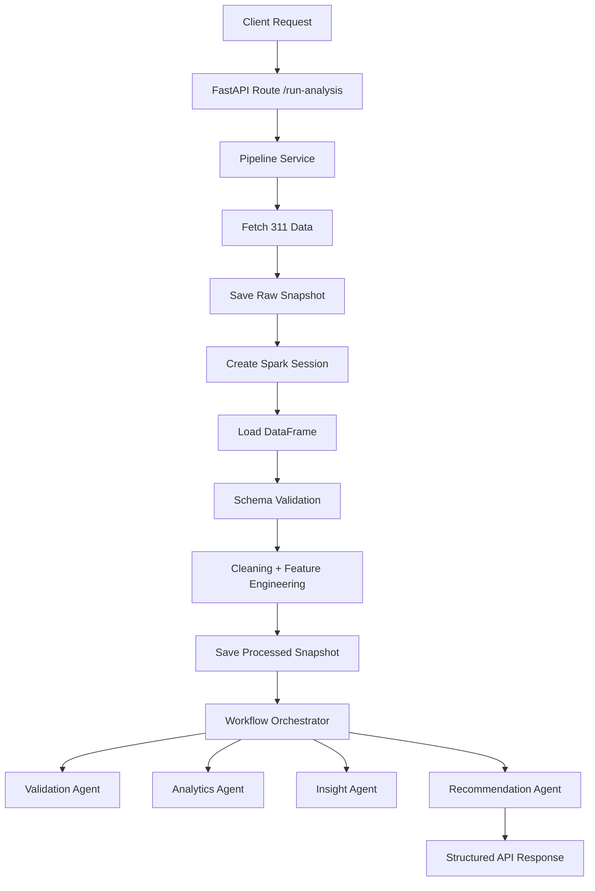

# 311 Complaint Resolution Product

An agent-driven analytics platform for NYC 311 service requests, built with FastAPI and PySpark. The system ingests complaint data, applies transformation and feature engineering, computes operational performance metrics, and produces insights plus action-oriented recommendations.

## Executive Summary

This project provides an end-to-end operational analytics pipeline that helps teams answer questions such as:
- Are service requests being resolved within expected timelines?
- Which complaint categories and boroughs have the highest operational impact?
- Is backlog growth threatening service quality?
- What concrete actions should operations teams take next?

The platform exposes a lightweight API endpoint that triggers the full pipeline and returns structured outputs for validation, analytics, insights, recommendations, and timing telemetry.

## Core Capabilities

- API-triggered analytics workflow using FastAPI
- Resilient ingestion from NYC Open Data (Socrata) with retry and pagination controls
- Spark-based transformation and feature engineering pipeline
- Agentic analysis chain:
  - Validation agent
  - Analytics agent
  - Insight agent
  - Recommendation agent
- Snapshot persistence for both raw and processed datasets
- Timing and stage-level observability for pipeline diagnostics
- Timeout-protected Spark actions for improved runtime stability

## Architecture



## Project Structure

```text
.
|-- main.py
|-- requirements.txt
|-- api/
|   |-- routes.py
|   `-- controllers.py
|-- core/
|   |-- config.py
|   `-- logger.py
|-- ingestion/
|   |-- api_client.py
|   |-- data_loader.py
|   |-- data_saver.py
|   `-- schema_validation.py
|-- processing/
|   |-- spark_session.py
|   |-- spark_operations.py
|   |-- transformations.py
|   |-- feature_engineering.py
|   `-- processed_data_saver.py
|-- agents/
|   |-- base_agent.py
|   |-- validation_agents.py
|   |-- analytics_agent.py
|   |-- insights_agent.py
|   `-- recommendation_agent.py
|-- orchestrator/
|   `-- workflow.py
|-- services/
|   `-- pipeline_services.py
|-- tests/
|   `-- test_processed_data_saver.py
`-- data/
    |-- raw/
    `-- processed/
```

## Technology Stack

- Python
- FastAPI
- Uvicorn
- PySpark
- Requests
- Pydantic
- python-dotenv

## Data and Analytics Workflow

1. Ingestion
- Pulls records from NYC 311 API in controlled batches.
- Applies date-window logic and robust retry behavior for transient errors.
- Standardizes accepted source aliases to canonical column names once at the ingestion/load boundary.

2. Persistence (raw)
- Saves raw API payload to timestamped JSON snapshots in data/raw.

3. Processing
- Creates a local Spark session tuned for stability.
- Loads JSON into a Spark DataFrame.
- Validates required schema and critical data quality constraints with one aggregate validation action.
- Cleans data (null filtering and deduplication).
- Parses timestamps using explicit configured formats.
- Tracks parse failures via created_ts_parse_failed, due_ts_parse_failed, and closed_ts_parse_failed.
- Adds resolution and SLA metrics.

4. Persistence (processed)
- Is intentionally configurable:
  - when SAVE_PROCESSED_SNAPSHOT=true, saves transformed records to a timestamped JSON file in data/processed
  - when SAVE_PROCESSED_SNAPSHOT=false, skips artifact writing while preserving analytics path correctness
- Uses Spark-based write paths and a streaming iterator fallback; avoids full-dataset collect.

5. Agentic Orchestration
- Validation Agent: row volume and null coverage checks.
- Analytics Agent: SLA, backlog, resolution distributions, SES, and segmented breakdowns.
- Insight Agent: threshold-based narrative interpretation.
- Recommendation Agent: operational actions derived from insights.

6. API Response
- Returns structured outputs and timing breakdowns for observability.

## Agent Contracts

All agents now use explicit typed contracts defined in agents/contracts.py.

Standard output envelope for every agent:
- status: success or error
- data: typed payload for that agent
- warnings: non-fatal issues
- errors: fatal or blocking issues captured by the agent

Agent input and output contract map:

| Agent | Input Contract | Output Contract | Data Payload Summary |
|---|---|---|---|
| ValidationAgent | ValidationAgentInput | ValidationAgentOutput | total_rows, null_counts, non_null_coverage |
| AnalyticsAgent | AnalyticsAgentInput | AnalyticsAgentOutput | SLA rates, resolution metrics, backlog, SES, borough and complaint breakdowns |
| InsightAgent | InsightAgentInput | InsightAgentOutput | insights list and prioritization signals |
| RecommendationAgent | RecommendationAgentInput | RecommendationAgentOutput | deterministic recommendation objects with id, category, priority, recommendation text, evidence and strongest_evidence |

Integration notes:
- Orchestration passes typed contracts between agents and normalizes outputs to dictionaries at the workflow boundary.
- External consumers should rely on the envelope fields plus the documented payload keys in data.
- Recommendation objects are stable for integration due to deterministic IDs, categories and ordering.

## Execution Model and Phase Gate Status

Current phase-exit status: met.

Why this gate is considered met:
- Every agent has a clear responsibility and explicit typed input/output contracts.
- Orchestration is deterministic and staged in fixed order: validation -> analytics -> insight -> recommendation.
- Workflow execution is observable through run-level and stage-level status, timestamps, durations, warnings and errors.
- Fatal failures stop downstream stages and produce a structured failed workflow result.
- Integration tests verify both successful execution order and failure propagation behavior.

Agent runtime classification:

| Agent | Runtime Type | Notes |
|---|---|---|
| ValidationAgent | Rule-based | Deterministic Spark/data checks |
| AnalyticsAgent | Rule-based | Deterministic metric and aggregation logic |
| InsightAgent | Rule-based | Deterministic threshold/condition rules |
| RecommendationAgent | Rule-based | Deterministic priority, evidence and dedup rules |

LLM-assisted agent behavior is not currently used in runtime pipeline execution.

## KPI Layer Contract

The KPI layer in processing/kpi_module.py uses Spark transformations and aggregations to produce API-ready bounded outputs.

Rules:
- No full dataset collect during KPI computation.
- Convert only final bounded aggregates to Python objects.
- Enforce bounded payload slices with top_n, trend_points, and agency_category_limit.

Primary KPI outputs include:
- volume and rates: total_requests, open_requests, closed_requests, open_rate, closed_rate
- service levels: sla_breach_count, sla_breach_rate, sla_compliance_rate
- timing: avg_resolution_time, median_resolution_time, p90_resolution_time
- bounded segments: time_trends, top_complaint_types, top_agencies, borough_performance, backlog_ageing, agency_category_performance, status_breakdown

## API Reference

### Health Check
- Method: GET
- Path: /
- Purpose: confirms the API is running

### Run Analysis Pipeline
- Method: POST
- Path: /run-analysis
- Query params (optional):
  - start_date (YYYY-MM-DD)
  - end_date (YYYY-MM-DD)

Example request (PowerShell):

```powershell
Invoke-RestMethod -Method Post -Uri "http://127.0.0.1:8000/run-analysis?start_date=2026-01-01&end_date=2026-06-01"
```

Example response shape:

```json
{
  "status": "success",
  "data": {
    "status": "success",
    "message": "Pipeline executed successfully",
    "results": {
      "validation": {},
      "analytics": {},
      "insights": {},
      "recommendations": {},
      "timings": {}
    },
    "timings": {}
  }
}
```

## Setup and Installation

### Prerequisites

- Python installed
- Java runtime available for Spark
- Optional local Hadoop binaries for some Windows Spark setups (configured via environment variables)

### Install Dependencies

```powershell
pip install -r requirements.txt
```

## Configuration

Runtime configuration is defined in core/config.py via environment variables.

Start by copying `.env.example` to `.env` and adjust only what you need for your runtime.

| Variable | Default | Description |
|---|---|---|
| DATA_PATH | data/raw/ | Raw snapshot output directory |
| PROCESSED_PATH | data/processed/ | Processed snapshot output directory |
| LOG_LEVEL | INFO | Logging level |
| API_URL | https://data.cityofnewyork.us/resource/erm2-nwe9.json | Source endpoint |
| API_LIMIT | 25000 | Max records fetched per run |
| API_BATCH_SIZE | 1000 | Records per API page |
| API_TIMEOUT | 240 | API read timeout in seconds |
| API_START_DATE | Last 30 days start | Default start date |
| API_END_DATE | Today | Default end date |
| TIMESTAMP_FORMATS | yyyy-MM-dd'T'HH:mm:ss\|yyyy-MM-dd HH:mm:ss\|yyyy-MM-dd | Pipe-separated timestamp parse formats |
| SPARK_EXECUTION_MODE | local | Local/scalable defaults selector |
| SPARK_MASTER | local[*] | Spark master |
| SPARK_SHUFFLE_PARTITIONS | 2 (local default) | Shuffle partition count |
| SPARK_DEFAULT_PARALLELISM | 2 (local default) | Default parallelism |
| SPARK_LOCAL_IP | 127.0.0.1 | Spark local bind IP for driver/executor connectivity |
| SPARK_LOCAL_HOSTNAME | localhost | Local Spark hostname override |
| SPARK_DRIVER_BIND_ADDRESS | 127.0.0.1 | Spark driver bind address |
| SPARK_DRIVER_HOST | 127.0.0.1 | Spark driver host |
| SPARK_LOCAL_DIR | OS temp spark-local dir | Spark temp working directory |
| SPARK_WAREHOUSE_DIR | OS temp spark-warehouse dir | Spark SQL warehouse location |
| PYSPARK_SUBMIT_ARGS | unset | Optional Spark submit args override |
| HADOOP_HOME | unset | Optional Hadoop installation path |
| HADOOP_BIN_DIR | unset | Optional Hadoop bin path added to PATH |
| SAVE_PROCESSED_SNAPSHOT | true | Enable/disable processed snapshot persistence |
| PROCESSED_WRITE_PARTITIONS | 1 (local default) | Partitions used by processed snapshot writer |

## Spark Partitioning and Caching Policy

- Local mode defaults to low partition counts for developer speed.
- Scalable execution is enabled by overriding SPARK_MASTER and partition settings.
- Adaptive query execution is enabled in Spark session configuration.
- DataFrames are cached only when reused across stages and then unpersisted after completion.
- Repeated actions are avoided unless data is intentionally cached and materialized.

## Running the Application

Start the API server:

```powershell
python main.py
```

The service binds to localhost and auto-selects an available port (default preference: 8000).

## Testing

Run test suite:

```powershell
pytest
```

Utility scripts:
- test_env.py: validates interpreter and subprocess behavior
- test_pipeline.py: executes a full pipeline run with console diagnostics

## Observability and Runtime Diagnostics

- Stage-level timing telemetry is captured in pipeline execution output.
- Logs include step markers for ingestion, Spark startup, validation, transformation, save steps, and orchestration.
- Timeout-aware Spark wrappers reduce risk of indefinite blocking during collect and count operations.

## Data Artifacts

- Raw snapshots: data/raw
- Processed snapshots: data/processed

Each run creates timestamped JSON files to support reproducibility, backtracking, and auditability.

## Reliability Features

- Retries and backoff for transient API/network failures
- Per-offset retry circuit breaker to avoid endless pagination loops
- Date-window normalization and fallback behavior
- Defensive error handling at each pipeline stage
- Graceful continuation if processed snapshot save encounters non-fatal issues

## Roadmap Suggestions

- Expand unit and integration test coverage across ingestion and agent outputs
- Add CI workflow definitions under workflows/
- Add API auth and request throttling for production deployment
- Add persistent metric sink for long-term trend analysis

## Contributing

1. Create a feature branch.
2. Implement and test your changes.
3. Keep code style and logging conventions consistent.
4. Submit a pull request with clear rationale and validation notes.

## License

No explicit license file is currently present. Add a LICENSE file before external distribution.
